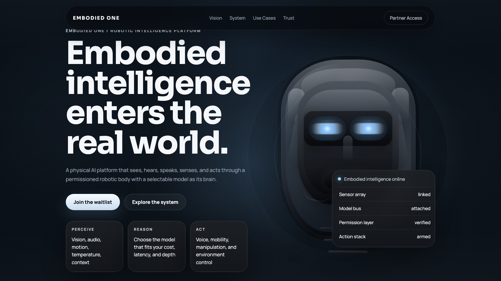

# Embodied One Landing Page

Single-page, investor-facing concept site for a futuristic robotics startup focused on embodied AI.



[Live Demo](https://randomwalkhan.github.io/embodied-one-landing/) | [Repository](https://github.com/randomwalkhan/embodied-one-landing)

## Stack

- Static `HTML` + `CSS` + `JavaScript`
- No build step required
- Google Fonts for typography (`Sora` + `Manrope`)

## File structure

```text
robotics-landing/
  assets/
    repo-preview.png
  index.html
  styles.css
  script.js
  README.md
```

## Run locally

From the repository root:

```bash
cd "robotics-landing"
python3 -m http.server 4173
```

Then open:

```text
http://localhost:4173
```

`index.html` can also be opened directly in a browser, but a local server is better for iteration.

## What is included

- Full-screen cinematic hero on a near-black background
- Scroll-triggered robot activation with eye-opening and boot-up states
- Vision, platform layers, timing, use cases, safety, and partner/investor sections
- Responsive layout for desktop, tablet, and mobile
- Placeholder contact capture area with a local demo handler

## Animation logic

The signature hero moment is controlled in `script.js`.

- The opening section is a sticky hero with extra scroll height.
- JavaScript measures scroll progress through that hero section.
- That progress updates CSS custom properties:
  - `--activation`
  - `--boot-intensity`
  - `--eye-open`
- CSS uses those variables to animate:
  - the robot head lift and subtle perspective shift
  - the glow strength around the head
  - the eyelids sliding open
  - the system status panel transitioning from standby to online

Content cards use `IntersectionObserver` so sections reveal cleanly as they enter the viewport.

## Easy iteration points

- Update copy directly in `index.html`
- Adjust palette, spacing, and materials in `styles.css`
- Tune hero thresholds and activation feel in `script.js`
- Replace the contact form demo handler in `script.js` with a real API or CRM submission flow
